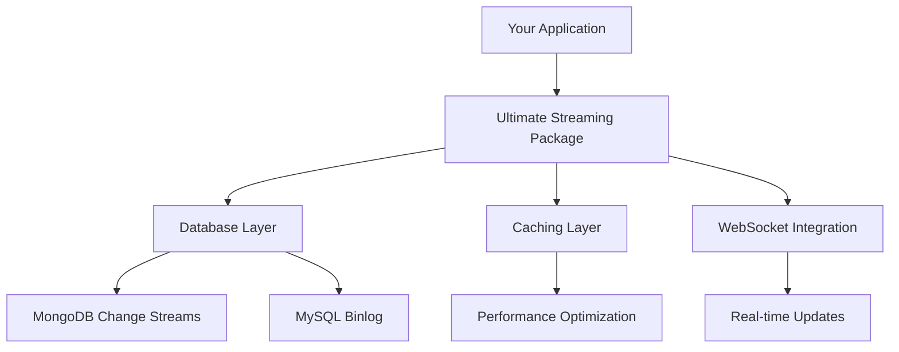

# Ultimate Streaming Package - Documentation

Welcome to the complete documentation for the Ultimate Streaming Package! This documentation is designed to help you quickly install, integrate, and get the most out of our high-performance real-time streaming solution.

## 📚 Documentation Structure

### 🚀 **Getting Started**
- **[Quick Start Guide](quick-start/)** - Get up and running in 5 minutes
- **[Installation Guide](quick-start/#installation)** - Detailed installation instructions
- **[Basic Examples](quick-start/#examples)** - Simple usage examples

### 🔧 **Integration Guides**
- **[Framework Integration](integration/)** - Express.js, React, Next.js, and more
- **[WebSocket Setup](integration/#websocket-integration)** - Real-time web applications
- **[Database Configuration](integration/#database-setup)** - MongoDB and MySQL setup
- **[Production Deployment](integration/#production)** - Deployment best practices

### 📊 **Performance & Optimization**
- **[Benchmarks](benchmarks/)** - Performance comparisons and test results
- **[Optimization Guide](benchmarks/#optimization)** - Tips for maximum performance
- **[Monitoring](benchmarks/#monitoring)** - Performance monitoring and metrics

### 💼 **Business Value**
- **[Use Cases](use-cases/)** - Industry-specific implementation examples
- **[ROI Analysis](use-cases/business-value.md)** - Business impact and cost savings
- **[Success Stories](use-cases/#case-studies)** - Real-world implementations

## 🎯 **Quick Navigation**

### For Integration Teams
```bash
# Install the package
npm install @krunal_tarale-5/ultimate-streaming-package

# Basic MongoDB setup
const streamer = new UltimateStreamer({
  database: 'mongodb',
  connection: { uri: 'mongodb://localhost:27017/mydb' }
});
```

### For Technical Leaders
- **[Business Value Analysis](use-cases/business-value.md)** - ROI and cost impact
- **[Performance Benchmarks](benchmarks/performance-comparison.md)** - 99.96% improvement metrics
- **[Security Considerations](../SECURITY.md)** - Enterprise security features

### For System Architects
- **[System Architecture](integration/#architecture)** - How it fits in your stack
- **[Scalability Guide](integration/#scalability)** - Handling high traffic
- **[Deployment Patterns](integration/#deployment-patterns)** - Best practices

## 🏗️ **System Architecture Overview**



## 📋 **Common Integration Patterns**

### 1. **Real-time Dashboard**
```javascript
// Perfect for analytics dashboards
streamer.on('change', (data) => {
  updateDashboard(data);
  broadcastToClients(data);
});
```

### 2. **E-commerce Inventory**
```javascript
// Real-time inventory updates
streamer.on('change', (data) => {
  if (data.collection === 'inventory') {
    notifyStockChanges(data);
  }
});
```

### 3. **Collaborative Applications**
```javascript
// Multi-user real-time collaboration
streamer.on('change', (data) => {
  broadcastToRoom(data.documentId, data);
});
```

## 🎮 **Try the Demo**

Experience the power of Ultimate Streaming Package with our complete demo application:

```bash
git clone https://github.com/KrunalTarale5/ultimate-streaming-package.git
cd ultimate-streaming-package
npm run demo
```

The demo showcases:
- **Real-time order management system**
- **Live inventory synchronization**
- **Multi-user real-time updates**
- **Performance monitoring dashboard**

## 🔍 **Find What You Need**

| I want to... | Go to... |
|--------------|----------|
| Get started quickly | [Quick Start Guide](quick-start/) |
| Integrate with my framework | [Integration Guide](integration/) |
| See performance data | [Benchmarks](benchmarks/) |
| Build a business case | [Business Value](use-cases/business-value.md) |
| Deploy to production | [Production Guide](integration/#production) |

## 💡 **Key Benefits**

- **🔥 99.96% Latency Improvement** - From 250ms to 1ms response times
- **💾 73% Memory Efficiency** - Optimized resource usage
- **🚀 75,000+ Operations/Second** - Enterprise-scale throughput
- **🔄 Real-time Change Detection** - Instant database updates
- **🛡️ Production Ready** - Built-in error handling and recovery
- **📝 Complete TypeScript Support** - Full type safety

## 🤝 **Getting Help**

### Documentation Support
- Browse the guides above for comprehensive information
- Check the [Integration Examples](integration/) for your specific use case
- Review [Performance Benchmarks](benchmarks/) for optimization tips

### Technical Support
- **GitHub Issues**: [Report bugs or request features](https://github.com/KrunalTarale5/ultimate-streaming-package/issues)
- **Email Support**: [krunaltarale555@gmail.com](mailto:krunaltarale555@gmail.com)
- **Response Time**: 24-48 hours for all inquiries

### Community
- **Discussions**: GitHub Discussions for questions and community support
- **Contributing**: See [CONTRIBUTING.md](../CONTRIBUTING.md) for contribution guidelines

## 🚀 **Ready to Get Started?**

1. **[Install the package](quick-start/)** - 2-minute setup
2. **[Try the examples](quick-start/#examples)** - See it in action
3. **[Integrate with your app](integration/)** - Production-ready implementation
4. **[Optimize performance](benchmarks/#optimization)** - Maximize efficiency

---

**Questions?** Start with our [Quick Start Guide](quick-start/) or reach out to [krunaltarale555@gmail.com](mailto:krunaltarale555@gmail.com) 