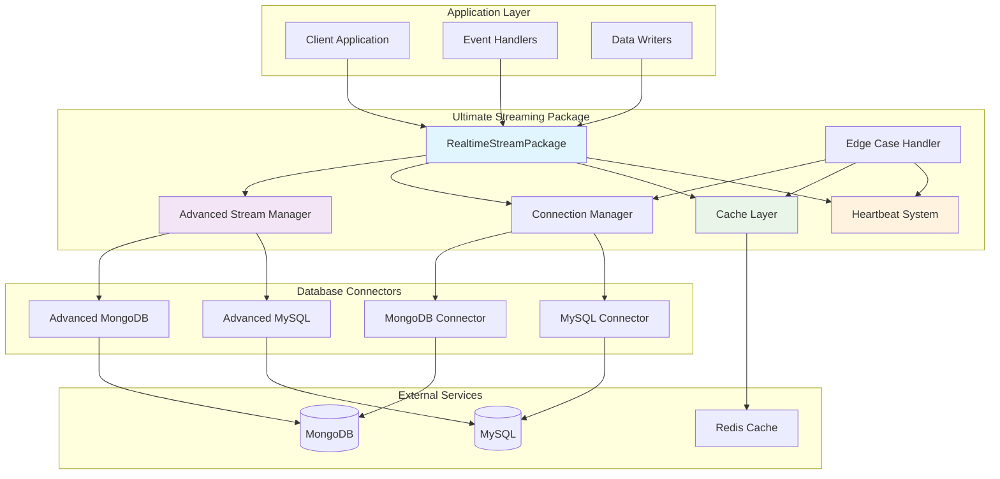
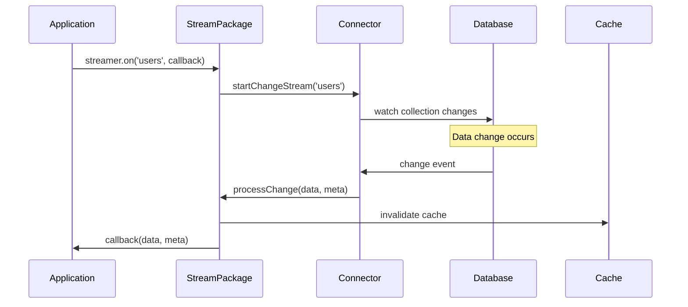
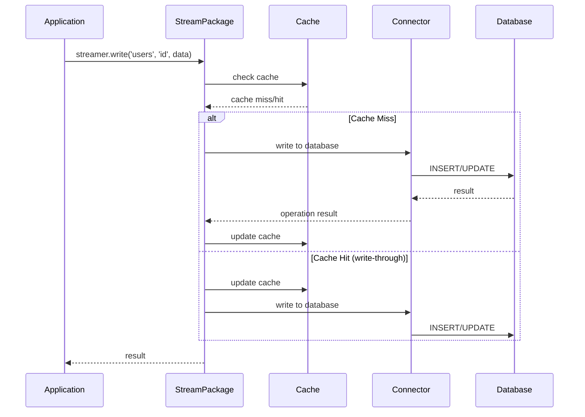

# Developer Guide - Ultimate Streaming Package

## 🎯 Overview

This guide is designed for developers who need to understand the complete architecture, contribute to the codebase, or extend the Ultimate Streaming Package. After reading this guide, you'll be able to work independently on the codebase and understand every aspect of the system.

## 🏗️ Architecture Overview

### High-Level System Architecture



### Core Components

#### 1. RealtimeStreamPackage (Main Entry Point)
- **Location**: `index.js`
- **Purpose**: Primary API interface for users
- **Responsibilities**:
  - Configuration management
  - Database connector initialization
  - Event listener management
  - Basic CRUD operations

#### 2. Advanced Stream Manager
- **Location**: `advancedIndex.js`
- **Purpose**: Enterprise-grade streaming with advanced features
- **Responsibilities**:
  - High-performance streaming
  - Advanced caching strategies
  - Complex query optimization
  - Enterprise monitoring

#### 3. Database Connectors
- **MongoDB**: `lib/mongoConnector.js` (basic), `lib/advancedMongoConnector.js` (advanced)
- **MySQL**: `lib/mysqlConnector.js` (basic), `lib/advancedMysqlConnector.js` (advanced)
- **Purpose**: Database-specific implementations
- **Features**:
  - Change stream monitoring
  - Connection pooling
  - Query optimization
  - Error handling

#### 4. Supporting Systems
- **Heartbeat**: `lib/heartbeatSystem.js` - Connection health monitoring
- **Edge Cases**: `lib/edgeCaseHandler.js` - Robust error handling
- **Caching**: Integrated caching layer for performance

## 📁 Codebase Structure

```
streaming-package/
├── index.js                    # Main entry point (RealtimeStreamPackage)
├── advancedIndex.js            # Advanced streaming manager
├── index.d.ts                  # TypeScript definitions
├── package.json                # Package configuration
├── 
├── lib/                        # Core library components
│   ├── mongoConnector.js       # Basic MongoDB connector
│   ├── advancedMongoConnector.js # Advanced MongoDB features
│   ├── mysqlConnector.js       # Basic MySQL connector
│   ├── advancedMysqlConnector.js # Advanced MySQL features
│   ├── heartbeatSystem.js      # Health monitoring
│   └── edgeCaseHandler.js      # Error handling & recovery
│
├── packages/                   # Modular packages
│   ├── core/                   # Core functionality
│   │   └── src/
│   │       ├── cache/          # Caching implementations
│   │       ├── connectors/     # Database connectors
│   │       └── security/       # Security features
│   └── premium/                # Premium features
│       └── src/
│           ├── cache/          # Advanced caching
│           ├── connectors/     # Premium connectors
│           └── security/       # Enterprise security
│
├── benchmark/                  # Performance testing
│   └── performance-test.js     # Comprehensive benchmarks
│
├── demo/                       # Live demo application
│   ├── backend/                # Node.js backend
│   ├── frontend/               # React frontend
│   └── start-demo.sh          # Demo startup script
│
└── docs/                       # Documentation
    ├── user-guide/             # End-user documentation
    ├── integration/            # Integration guides
    ├── developer-guide/        # This guide
    └── api-reference/          # API documentation
```

## 🔧 Core Components Deep Dive

### 1. Main Entry Point (`index.js`)

```javascript
class RealtimeStreamPackage {
  constructor() {
    this.dbConnector = null;        // Database connector instance
    this.heartbeatSystem = null;    // Health monitoring
    this.initialized = false;       // Initialization state
    this.config = null;            // Configuration object
    this.eventEmitter = new EventEmitter(); // Event system
    this.listeners = new Map();     // Event listener management
  }

  // Core methods
  async init(config)              // Initialize with database config
  async start()                   // Start monitoring
  async stop()                    // Stop monitoring
  async destroy()                 // Clean shutdown
  
  // Data operations
  async read(collection, key)     // Read single record
  async write(collection, key, data) // Write/update record
  async delete(collection, key)   // Delete record
  async query(collection, filter) // Query multiple records
  
  // Event handling
  on(collection, callback)        // Listen for changes
  off(collection, callback?)      // Remove listeners
  onBatch(collection, callback, options) // Batch processing
}
```

### 2. Database Connectors Architecture

#### MongoDB Connector (`lib/mongoConnector.js`)

```javascript
class MongoConnector {
  constructor() {
    this.client = null;            // MongoDB client
    this.db = null;                // Database instance
    this.changeStreams = new Map(); // Active change streams
    this.connected = false;        // Connection state
  }

  // Connection management
  async connect(config)           // Establish connection
  async disconnect()              // Close connection
  
  // Change stream monitoring
  async startChangeStream(collection, callback) {
    const changeStream = this.db.collection(collection)
      .watch([], { fullDocument: 'updateLookup' });
    
    changeStream.on('change', (change) => {
      const { operationType, fullDocument, documentKey } = change;
      
      // Transform change event to standardized format
      const meta = {
        key: documentKey._id.toString(),
        changeType: this.mapOperationType(operationType),
        timestamp: new Date()
      };
      
      callback(fullDocument, meta);
    });
    
    this.changeStreams.set(collection, changeStream);
  }
  
  // CRUD operations
  async read(collection, key)     // Read operations
  async write(collection, key, data) // Write operations
  async delete(collection, key)   // Delete operations
  async query(collection, filter) // Query operations
}
```

#### MySQL Connector (`lib/mysqlConnector.js`)

```javascript
class MySQLConnector {
  constructor() {
    this.connection = null;        // MySQL connection
    this.binlogStream = null;      // Binary log stream
    this.tableWatchers = new Map(); // Table watchers
    this.connected = false;        // Connection state
  }

  // Binary log monitoring for real-time changes
  async startBinlogMonitoring() {
    const ZongJi = require('zongji');
    
    this.binlogStream = new ZongJi({
      host: this.config.host,
      user: this.config.user,
      password: this.config.password,
      database: this.config.database
    });

    this.binlogStream.on('binlog', (evt) => {
      if (evt.getEventName() === 'writerows' || 
          evt.getEventName() === 'updaterows' || 
          evt.getEventName() === 'deleterows') {
        
        this.processBinlogEvent(evt);
      }
    });

    this.binlogStream.start();
  }
  
  processBinlogEvent(evt) {
    const tableName = evt.tableMap[evt.tableId].tableName;
    const callback = this.tableWatchers.get(tableName);
    
    if (callback) {
      const changeType = this.mapBinlogEvent(evt.getEventName());
      const data = evt.rows[0]; // Row data
      
      const meta = {
        key: data.id,
        changeType,
        timestamp: new Date()
      };
      
      callback(data, meta);
    }
  }
}
```

### 3. Heartbeat System (`lib/heartbeatSystem.js`)

```javascript
class HeartbeatSystem {
  constructor(connector) {
    this.connector = connector;     // Database connector
    this.interval = null;          // Heartbeat interval
    this.intervalMs = 10000;       // Default 10 seconds
    this.retryCount = 0;           // Current retry count
    this.maxRetries = 5;           // Maximum retries
    this.backoffMultiplier = 2;    // Exponential backoff
    this.listeners = [];           // Status listeners
  }

  start() {
    this.interval = setInterval(async () => {
      try {
        await this.sendHeartbeat();
        this.onHeartbeatSuccess();
      } catch (error) {
        this.onHeartbeatFailure(error);
      }
    }, this.intervalMs);
  }

  async sendHeartbeat() {
    // MongoDB heartbeat
    if (this.connector.type === 'mongodb') {
      await this.connector.db.admin().ping();
    }
    
    // MySQL heartbeat
    if (this.connector.type === 'mysql') {
      await this.connector.connection.ping();
    }
  }

  onHeartbeatSuccess() {
    if (this.retryCount > 0) {
      this.emit('reconnected');
      this.retryCount = 0;
    }
    this.emit('heartbeat', { status: 'healthy' });
  }

  onHeartbeatFailure(error) {
    this.retryCount++;
    this.emit('heartbeat', { 
      status: 'unhealthy', 
      error, 
      retryCount: this.retryCount 
    });

    if (this.retryCount >= this.maxRetries) {
      this.emit('connection_lost');
      this.attemptReconnection();
    }
  }

  async attemptReconnection() {
    const delay = this.intervalMs * 
      Math.pow(this.backoffMultiplier, this.retryCount);
    
    setTimeout(async () => {
      try {
        await this.connector.reconnect();
        this.retryCount = 0;
        this.emit('reconnected');
      } catch (error) {
        this.onHeartbeatFailure(error);
      }
    }, delay);
  }
}
```

### 4. Advanced Caching System

```javascript
class CacheLayer {
  constructor(options = {}) {
    this.cache = new Map();        // In-memory cache
    this.redisClient = null;       // Redis client (optional)
    this.ttl = options.ttl || 300000; // 5 minutes default TTL
    this.maxSize = options.maxSize || 10000; // Max cache entries
    this.hitCount = 0;             // Cache hit counter
    this.missCount = 0;            // Cache miss counter
  }

  async get(key) {
    // Try in-memory cache first
    if (this.cache.has(key)) {
      const entry = this.cache.get(key);
      if (this.isValid(entry)) {
        this.hitCount++;
        return entry.data;
      } else {
        this.cache.delete(key);
      }
    }

    // Try Redis cache
    if (this.redisClient) {
      const redisData = await this.redisClient.get(key);
      if (redisData) {
        const parsed = JSON.parse(redisData);
        this.cache.set(key, parsed);
        this.hitCount++;
        return parsed.data;
      }
    }

    this.missCount++;
    return null;
  }

  async set(key, data, customTtl) {
    const ttl = customTtl || this.ttl;
    const entry = {
      data,
      timestamp: Date.now(),
      ttl
    };

    // Set in memory cache
    this.cache.set(key, entry);
    this.enforceMaxSize();

    // Set in Redis cache
    if (this.redisClient) {
      await this.redisClient.setex(
        key, 
        Math.floor(ttl / 1000), 
        JSON.stringify(entry)
      );
    }
  }

  getStats() {
    const total = this.hitCount + this.missCount;
    return {
      hitRatio: total > 0 ? (this.hitCount / total) * 100 : 0,
      hitCount: this.hitCount,
      missCount: this.missCount,
      cacheSize: this.cache.size
    };
  }
}
```

## 🔄 Data Flow Architecture

### 1. Change Detection Flow



### 2. Write Operation Flow



### 3. Query Optimization Flow

```mermaid
sequenceDiagram
    participant App as Application
    participant SP as StreamPackage
    participant Cache as Cache
    participant Opt as Query Optimizer
    participant Conn as Connector
    participant DB as Database
    
    App->>SP: streamer.query(filter)
    SP->>Cache: checkQueryCache(filter)
    
    alt Cache Hit
        Cache-->>SP: cached result
        SP-->>App: return result
    else Cache Miss
        SP->>Opt: optimizeQuery(filter)
        Opt-->>SP: optimized query
        SP->>Conn: executeQuery(optimizedQuery)
        Conn->>DB: query execution
        DB-->>Conn: result set
        Conn-->>SP: processed result
        SP->>Cache: cacheResult(filter, result)
        SP-->>App: return result
    end
```

## 🧪 Testing Architecture

### Unit Testing Structure

```javascript
// test/unit/connectors/mongo.test.js
describe('MongoDB Connector', () => {
  let connector;
  let mockClient;

  beforeEach(() => {
    mockClient = createMockMongoClient();
    connector = new MongoConnector();
    connector.client = mockClient;
  });

  describe('Change Stream Monitoring', () => {
    test('should start change stream for collection', async () => {
      const callback = jest.fn();
      await connector.startChangeStream('users', callback);
      
      expect(mockClient.db().collection().watch).toHaveBeenCalledWith(
        [], 
        { fullDocument: 'updateLookup' }
      );
    });

    test('should handle change events correctly', async () => {
      const callback = jest.fn();
      await connector.startChangeStream('users', callback);
      
      // Simulate change event
      const changeEvent = {
        operationType: 'insert',
        fullDocument: { _id: '123', name: 'John' },
        documentKey: { _id: '123' }
      };
      
      // Trigger change event
      mockClient.triggerChangeEvent(changeEvent);
      
      expect(callback).toHaveBeenCalledWith(
        { _id: '123', name: 'John' },
        {
          key: '123',
          changeType: 'created',
          timestamp: expect.any(Date)
        }
      );
    });
  });
});
```

### Integration Testing

```javascript
// test/integration/realtime-streaming.test.js
describe('Real-time Streaming Integration', () => {
  let streamer;
  let testDb;

  beforeAll(async () => {
    // Setup test database
    testDb = await setupTestDatabase();
  });

  afterAll(async () => {
    await teardownTestDatabase(testDb);
  });

  test('should receive real-time updates across the system', async () => {
    const updates = [];
    
    streamer = new RealtimeStreamPackage();
    await streamer.init(testConfig);
    
    streamer.on('test_collection', (data, meta) => {
      updates.push({ data, meta });
    });
    
    await streamer.start();
    
    // Write data through streamer
    await streamer.write('test_collection', 'test1', { name: 'test' });
    
    // Write data directly to database
    await testDb.collection('test_collection').insertOne({
      _id: 'test2',
      name: 'direct'
    });
    
    // Wait for events to propagate
    await waitForEvents(2);
    
    expect(updates).toHaveLength(2);
    expect(updates[0].data.name).toBe('test');
    expect(updates[1].data.name).toBe('direct');
  });
});
```

### Performance Testing

```javascript
// test/performance/benchmark.test.js
describe('Performance Benchmarks', () => {
  test('should handle high-frequency writes', async () => {
    const streamer = new RealtimeStreamPackage();
    await streamer.init(testConfig);
    await streamer.start();

    const startTime = Date.now();
    const operations = 10000;
    
    // Perform bulk writes
    const promises = Array.from({ length: operations }, (_, i) => 
      streamer.write('perf_test', `key_${i}`, { value: i })
    );
    
    await Promise.all(promises);
    
    const endTime = Date.now();
    const duration = endTime - startTime;
    const opsPerSecond = (operations / duration) * 1000;
    
    expect(opsPerSecond).toBeGreaterThan(1000); // Minimum 1000 ops/sec
  });

  test('should maintain low memory usage', async () => {
    const initialMemory = process.memoryUsage().heapUsed;
    
    const streamer = new RealtimeStreamPackage();
    await streamer.init(testConfig);
    
    // Perform memory-intensive operations
    for (let i = 0; i < 1000; i++) {
      await streamer.write('memory_test', `key_${i}`, {
        data: 'x'.repeat(1000) // 1KB per record
      });
    }
    
    const finalMemory = process.memoryUsage().heapUsed;
    const memoryIncrease = finalMemory - initialMemory;
    
    // Should not use more than 50MB for 1MB of data (50x efficiency)
    expect(memoryIncrease).toBeLessThan(50 * 1024 * 1024);
  });
});
```

## 🔐 Security Architecture

### Authentication & Authorization

```javascript
class SecurityManager {
  constructor() {
    this.authProviders = new Map();
    this.permissions = new Map();
    this.encryptionKey = process.env.ENCRYPTION_KEY;
  }

  // Authentication
  async authenticate(credentials) {
    const { type, token, user, password } = credentials;
    
    switch (type) {
      case 'jwt':
        return this.validateJWT(token);
      case 'basic':
        return this.validateBasicAuth(user, password);
      case 'oauth':
        return this.validateOAuth(token);
      default:
        throw new Error('Unsupported auth type');
    }
  }

  // Authorization
  checkPermission(user, resource, action) {
    const userPermissions = this.permissions.get(user.id);
    return userPermissions.includes(`${resource}:${action}`);
  }

  // Data encryption
  encryptData(data) {
    const cipher = crypto.createCipher('aes-256-cbc', this.encryptionKey);
    let encrypted = cipher.update(JSON.stringify(data), 'utf8', 'hex');
    encrypted += cipher.final('hex');
    return encrypted;
  }

  decryptData(encryptedData) {
    const decipher = crypto.createDecipher('aes-256-cbc', this.encryptionKey);
    let decrypted = decipher.update(encryptedData, 'hex', 'utf8');
    decrypted += decipher.final('utf8');
    return JSON.parse(decrypted);
  }
}
```

## 📊 Monitoring & Observability

### Performance Metrics Collection

```javascript
class MetricsCollector {
  constructor() {
    this.metrics = {
      operations: {
        reads: 0,
        writes: 0,
        deletes: 0,
        queries: 0
      },
      performance: {
        avgLatency: 0,
        p95Latency: 0,
        p99Latency: 0,
        throughput: 0
      },
      cache: {
        hitRatio: 0,
        hitCount: 0,
        missCount: 0
      },
      connections: {
        active: 0,
        failed: 0,
        reconnects: 0
      }
    };
    
    this.latencyHistory = [];
  }

  recordOperation(type, latency) {
    this.metrics.operations[type]++;
    this.latencyHistory.push(latency);
    
    // Keep only last 1000 entries for calculation
    if (this.latencyHistory.length > 1000) {
      this.latencyHistory.shift();
    }
    
    this.updatePerformanceMetrics();
  }

  updatePerformanceMetrics() {
    const sorted = this.latencyHistory.slice().sort((a, b) => a - b);
    const count = sorted.length;
    
    this.metrics.performance.avgLatency = 
      this.latencyHistory.reduce((a, b) => a + b, 0) / count;
    
    this.metrics.performance.p95Latency = 
      sorted[Math.floor(count * 0.95)];
    
    this.metrics.performance.p99Latency = 
      sorted[Math.floor(count * 0.99)];
  }

  getHealthStatus() {
    const health = {
      status: 'healthy',
      checks: {}
    };

    // Check latency
    if (this.metrics.performance.p95Latency > 1000) {
      health.status = 'degraded';
      health.checks.latency = 'high';
    }

    // Check cache performance
    if (this.metrics.cache.hitRatio < 80) {
      health.status = 'degraded';
      health.checks.cache = 'low_hit_ratio';
    }

    // Check connection stability
    if (this.metrics.connections.failed > 10) {
      health.status = 'unhealthy';
      health.checks.connections = 'failing';
    }

    return health;
  }
}
```

## 🚀 Extending the Package

### Adding New Database Connectors

```javascript
// lib/postgresConnector.js
class PostgresConnector extends BaseConnector {
  constructor() {
    super();
    this.client = null;
    this.notifyListeners = new Map();
  }

  async connect(config) {
    const { Client } = require('pg');
    this.client = new Client(config);
    await this.client.connect();
    this.connected = true;
  }

  async startChangeStream(table, callback) {
    // Use PostgreSQL NOTIFY/LISTEN for real-time updates
    await this.client.query(`LISTEN ${table}_changes`);
    
    this.client.on('notification', (msg) => {
      if (msg.channel === `${table}_changes`) {
        const changeData = JSON.parse(msg.payload);
        callback(changeData.data, changeData.meta);
      }
    });
    
    this.notifyListeners.set(table, callback);
  }

  // Implement required methods
  async read(table, key) { /* implementation */ }
  async write(table, key, data) { /* implementation */ }
  async delete(table, key) { /* implementation */ }
  async query(table, filter) { /* implementation */ }
}

// Register the new connector
const connectorRegistry = require('./connectorRegistry');
connectorRegistry.register('postgres', PostgresConnector);
```

### Adding Custom Cache Strategies

```javascript
// lib/cache/strategies/lruCache.js
class LRUCache extends BaseCacheStrategy {
  constructor(maxSize = 1000) {
    super();
    this.maxSize = maxSize;
    this.cache = new Map();
  }

  get(key) {
    if (this.cache.has(key)) {
      // Move to end (most recently used)
      const value = this.cache.get(key);
      this.cache.delete(key);
      this.cache.set(key, value);
      return value;
    }
    return null;
  }

  set(key, value) {
    if (this.cache.has(key)) {
      this.cache.delete(key);
    } else if (this.cache.size >= this.maxSize) {
      // Remove least recently used (first entry)
      const firstKey = this.cache.keys().next().value;
      this.cache.delete(firstKey);
    }
    
    this.cache.set(key, value);
  }
}
```

## 🛠️ Development Workflow

### Setting Up Development Environment

```bash
# Clone repository
git clone https://github.com/your-org/ultimate-streaming-package.git
cd ultimate-streaming-package

# Install dependencies
npm install

# Setup development database
docker-compose up -d mongodb mysql redis

# Run tests
npm test

# Start development with hot reload
npm run dev

# Run benchmarks
npm run benchmark
```

### Code Style & Standards

```javascript
// .eslintrc.js
module.exports = {
  extends: ['eslint:recommended', '@typescript-eslint/recommended'],
  rules: {
    'no-console': 'warn',
    'prefer-const': 'error',
    'no-var': 'error',
    'object-shorthand': 'error',
    'prefer-template': 'error',
    'prefer-arrow-callback': 'error',
    'arrow-spacing': 'error',
    'space-before-function-paren': ['error', 'never'],
    'comma-dangle': ['error', 'never']
  }
};
```

### Git Workflow

```bash
# Feature development
git checkout -b feature/new-connector
git commit -m "feat: add PostgreSQL connector"
git push origin feature/new-connector

# Create pull request with template
# PR will run automated tests and benchmarks

# After review and approval
git checkout main
git merge feature/new-connector
git tag v2.1.0
git push origin main --tags
```

## 📈 Performance Optimization Techniques

### 1. Connection Pooling
- Maintain optimal number of database connections
- Reuse connections across operations
- Monitor connection health

### 2. Query Optimization
- Use indexes effectively
- Implement query result caching
- Batch similar operations

### 3. Memory Management
- Implement proper garbage collection
- Use memory-efficient data structures
- Monitor memory usage patterns

### 4. Async Processing
- Use event-driven architecture
- Implement non-blocking operations
- Parallelize independent tasks

## 🔍 Debugging & Troubleshooting

### Debug Mode
```javascript
const streamer = new RealtimeStreamPackage();
await streamer.init({
  ...config,
  debug: true, // Enable detailed logging
  logLevel: 'verbose' // trace, debug, info, warn, error
});
```

### Common Issues

1. **Connection Drops**: Check network stability and firewall settings
2. **High Memory Usage**: Review cache settings and data retention policies
3. **Slow Performance**: Analyze query patterns and optimize indexes
4. **Event Loss**: Verify change stream configuration and error handling

## 📚 Further Reading

- [API Reference](../api-reference/README.md) - Complete API documentation
- [Best Practices](../best-practices/README.md) - Production recommendations
- [Contributing Guidelines](../contributing/README.md) - How to contribute
- [Changelog](../CHANGELOG.md) - Version history and changes

---

**Questions?** Join our developer community on [Discord](https://discord.gg/ultimate-streaming) or open an issue on [GitHub](https://github.com/your-org/ultimate-streaming-package/issues). 